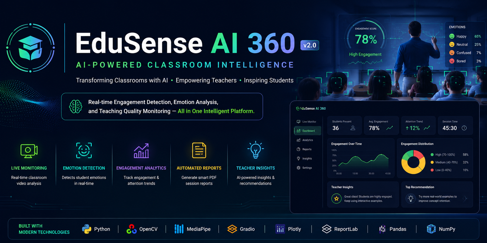
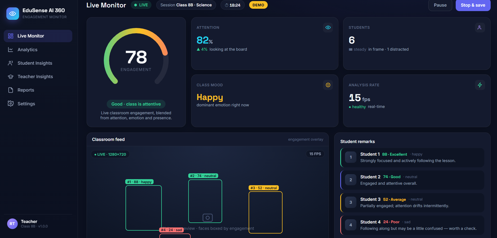
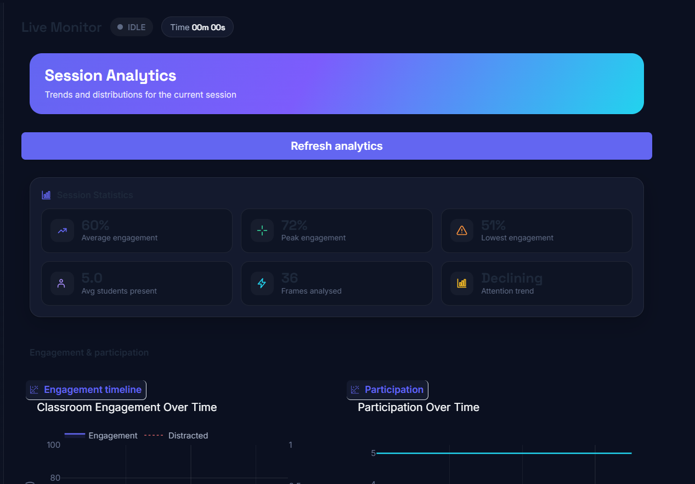

<p align="center">
  
</p>

<p align="center">


</p>

# 🎓 EduSense AI 360

> **AI-Powered Classroom Engagement & Teaching Quality Monitoring System using Computer Vision, Deep Learning and Real-Time Analytics**

---

# 🌟 Overview

EduSense AI 360 is an intelligent classroom analytics platform that leverages Artificial Intelligence and Computer Vision to help educators understand classroom engagement in real time.

The system analyzes classroom activity through a live camera feed and generates meaningful insights such as student engagement, attention trends, AI confidence scores, session analytics, and teacher recommendations.

Instead of evaluating individual students, EduSense AI 360 focuses on overall classroom learning patterns, helping teachers improve teaching effectiveness through data-driven insights.

---

# 📌 Project Highlights

- 🚀 Real-Time Classroom Analytics
- 🎯 AI-Powered Engagement Monitoring
- 😊 Emotion & Attention Analysis
- 👨‍🏫 AI Teacher Insights
- 📊 Interactive Analytics Dashboard
- 📄 Automated PDF Session Reports
- ⚡ Fast & Responsive User Interface
- 🔒 Privacy-Focused Classroom Analytics

---

# 📑 Table of Contents

- Overview
- Key Features
- Screenshots
- System Architecture
- Technology Stack
- Project Structure
- Installation
- System Workflow
- AI Processing Pipeline
- Performance Metrics
- Future Roadmap
- Applications
- Impact
- Developer
- License

---

# ✨ Key Features

- 🎥 Live Classroom Monitoring
- 😊 Emotion Detection
- 👀 Eye Tracking
- 🧠 Classroom Engagement Analysis
- 📊 Real-Time Analytics Dashboard
- 📈 Engagement Trend Graphs
- 📉 Analytics Visualization
- 👨‍🏫 AI Teacher Insights
- 📄 Automated Session Reports
- 📦 Exportable Reports
- ⚡ Fast Interactive Dashboard
- 🔒 Privacy-Focused Classroom Analytics

---

# 📸 Screenshots

## Dashboard



---

## Live Detection


---

## Live Tracking


---

## Analytics Dashboard



---

## Engagement Graph


---

## Analytics Graph


---

## Teacher Insights


---

## AI Confidence


---

## 📄 Session Reports

### Page 1


---

### Page 2


---

### Page 3


---

# 🏗️ System Architecture

```text
                Camera
                   │
                   ▼
              OpenCV Engine
                   │
                   ▼
             MediaPipe AI
                   │
                   ▼
        AI Processing Engine
      ├─────────────────────────┐
      │                         │
      ▼                         ▼
 Face Detection          Pose Detection
      │                         │
      └────────────┬────────────┘
                   ▼
        Emotion & Attention Analysis
                   │
                   ▼
        Engagement Score Calculation
                   │
                   ▼
         Teacher Insight Engine
                   │
                   ▼
      Dashboard • Analytics • Reports
```

---

# ⚙️ Technology Stack

| Category | Technology |
|----------|------------|
| Programming Language | Python 3.12+ |
| User Interface | Gradio |
| Computer Vision | OpenCV |
| AI Framework | MediaPipe |
| Emotion Detection | FER (Facial Emotion Recognition) |
| Data Processing | NumPy, Pandas |
| Interactive Charts | Plotly |
| Report Generation | ReportLab, OpenPyXL |
| Performance Monitoring | psutil |
| Project Architecture | Modular Python Design |

---

# 📂 Project Structure

```text
EduSense-AI-360/
│
├── main.py
├── backend/
├── frontend/
├── core/
├── config/
├── models/
├── assets/
├── samples/
├── documentation/
├── tests/
├── utilities/
├── requirements.txt
└── README.md
```

---

# 🚀 Installation

### Clone Repository

```bash
git clone https://github.com/jeevanvk22-ship-it/EduSense-AI-360.git
```

### Navigate into the Project

```bash
cd EduSense-AI-360
```

### Install Dependencies

```bash
pip install -r requirements.txt
```

### Run the Application

```bash
python main.py
```

---

# 🧠 System Workflow

```text
Camera Input
      │
      ▼
Frame Capture (OpenCV)
      │
      ▼
Face & Pose Detection (MediaPipe)
      │
      ▼
AI Engagement Analysis
      │
      ├───────────────┐
      ▼               ▼
Emotion Score   Attention Score
      │               │
      └──────┬────────┘
             ▼
 Engagement Calculation
             │
             ▼
 Teacher Insights Engine
             │
             ▼
 Dashboard + PDF Reports
```

---

# ⚙️ AI Processing Pipeline

1. Capture live classroom video.
2. Detect faces and body landmarks.
3. Analyze student emotions.
4. Estimate attention levels.
5. Compute engagement scores.
6. Generate teacher insights.
7. Display interactive analytics.
8. Export comprehensive PDF reports.

---

# 📊 Performance Metrics

- ⚡ Real-Time Processing
- 😊 Emotion Recognition
- 👀 Attention Detection
- 📈 Engagement Score
- 🤖 AI Confidence Indicator
- 📄 Automated PDF Reports
- 📊 Interactive Dashboard

---

# 🚀 Future Roadmap

- 📱 Mobile Application
- ☁️ Cloud Dashboard
- 🎥 Multi-Camera Classroom Support
- ✅ Smart Attendance Integration
- 🧠 AI Lesson Recommendations
- 🔥 Classroom Heatmaps
- 🌐 Multi-Language Support
- 🏫 School-Wide Analytics Platform

---

# 🎯 Applications

- 🏫 Schools
- 🎓 Colleges
- 🖥️ Smart Classrooms
- 📚 Educational Institutions
- 👨‍🏫 Teacher Training
- 🔬 Academic Research

---

# 🌍 Impact

EduSense AI 360 empowers educational institutions with AI-driven classroom analytics.

### Benefits

- 📈 Improves classroom engagement
- 👨‍🏫 Supports teachers with actionable insights
- 🎯 Enables data-driven teaching strategies
- 📄 Automates classroom reporting
- ⚡ Saves teachers valuable time
- 🏫 Enhances overall learning outcomes

---

# 👨‍💻 Developer

## **JEEVAN V K**

**Student Entrepreneur | AI Developer | Building AI Solutions for Education**

---

# 📄 License

This project is licensed under the **MIT License**.

---

# ⭐ Support

If you found this project helpful,

⭐ Star this repository

🍴 Fork the project

💡 Share your feedback

---

<h3 align="center">
🚀 Transforming Classrooms with Artificial Intelligence 🚀
</h3>

<p align="center">
Made with ❤️ using Python, OpenCV, MediaPipe & Gradio
</p>
